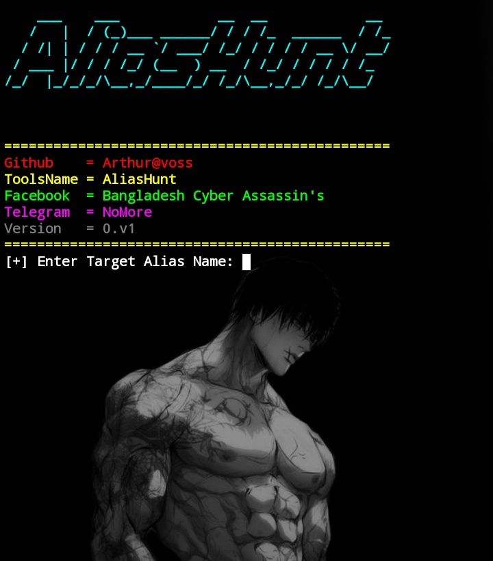

# AliasHunt-
AliasHunt is a lightweight python based tool designed for username osint (open source intelligence) investigation. It allows you to discover social media accounts, online profiles, and aliases associated with a particular username across multiple platforms.

## 🔹 Features

- ✅ Search usernames across popular social media and web platforms  
- ✅ Easy-to-use Python CLI interface  
- ✅ Generates a clean report of all discovered aliases  
- ✅ Fast and efficient scanning  
- ✅ Beginner-friendly and open-source

  ## Installation (Termux):
  termux-setup-storage
  yes | pkg up
  pkg i -y git python
  git clone https://github.com/ArthurVoss127/AliasHunt-.git
  cd AliasHunt-
  chmod +x *
  pip install pyfiglet
  pip install requests
  pip install termcolor
  python AliasHunt_encoded.py 
